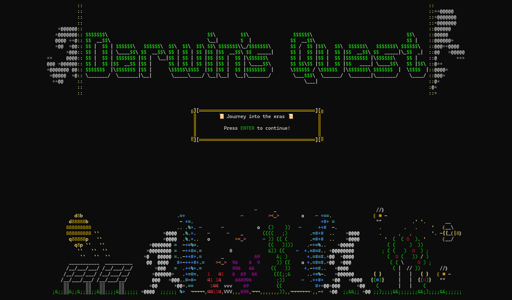
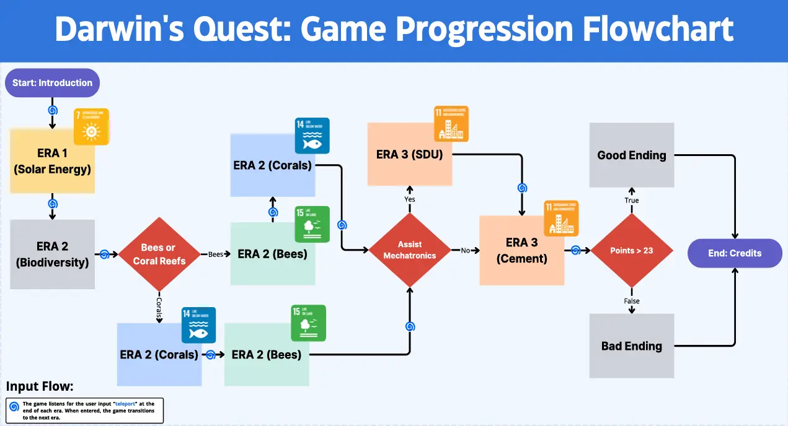
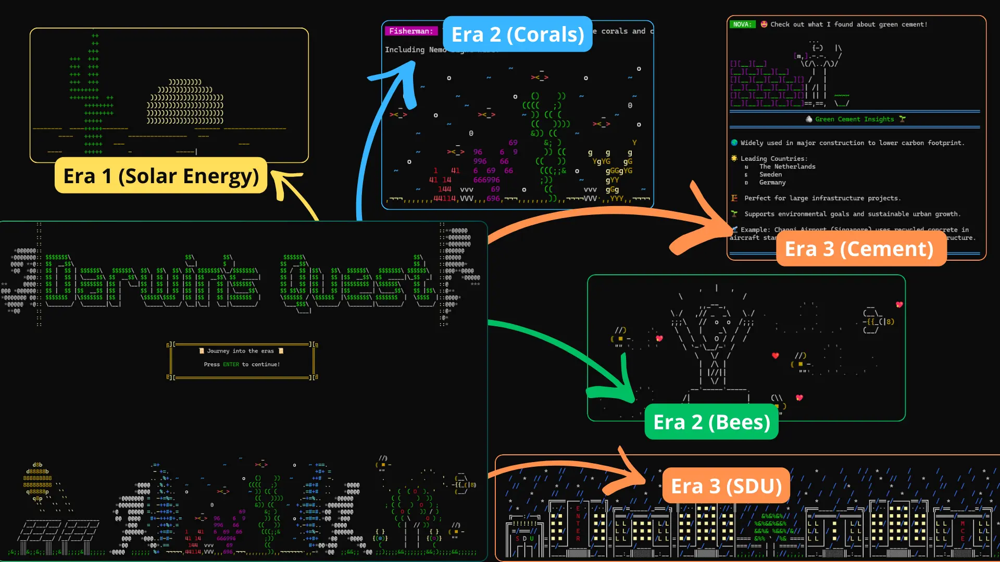

# 🌀 Semester Project 1: **World of Zuul** Collaboration

  

Welcome to the first semester project! Below is the structure and file distribution for our **World of Zuul** game project.

---

### 📁 **File Distribution**

| **File**                  | **Contributor**       | **Description**                                                                 |
|---------------------------|-----------------------|---------------------------------------------------------------------------------|
| `Darwin_Homeworld.cs`      | <a href="https://github.com/Lucol24" target="_blank">Luigi</a> | Introductory explanation of the game for Darwin's homeworld.                     |
| `Era 1.cs`                 | <a href="https://github.com/KlaraD24" target="_blank">Klara</a> | Manages the first era focusing on solar panels and energy sustainability.        |
| `Era 2 (Bees).cs`          | <a href="https://github.com/Lukkert" target="_blank">Lukas</a> | Handles the storyline focused on protecting bees and their ecosystems.           |
| `Era 2 (Corals).cs`        | <a href="https://github.com/Ardaatakol" target="_blank">Arda</a> | Manages the second storyline centered around coral reef preservation.            |
| `Era 3 (SDU).cs`           | Manish                | Interactions at SDU, focusing on beeswax and green cement (bio-materials).       |

If any changes are made to files outside of your domain, **please include comments** explaining those changes.

---

### 📜 **Shared Files**

Here are some of the shared files that manage key game features:

- **`NPC.cs`**: Handles the formatting of text badges for **non-playable characters** (NPCs), ensuring a uniform presentation throughout the game.
- **`PointSystem.cs`**: Tracks the player's **progress across different eras**. Currently a **work in progress**, it's not fully implemented yet.
- **`Transition.cs`**: Displays a series of **two emojis** for aesthetic separation of sections, enhancing the visual experience.
- **`EraTitle.cs`**: Responsible for the consistent **display and formatting of era titles**, keeping the look and feel uniform across the game.
- **`Portal.cs`**: Controls **teleportation logic** and manages the **execution flow** between various game files. It includes detailed comments to clarify its implementation.
- **`Map.cs`**: Allows the player to view their **current location in the game** with the `map` command, also showing the **number of rooms left** to reach the game's end.

---

### 🖼️ Visuals

#### Game Flow
The SDGs that are presented are developed through the game play.

  

#### ASCII Preview

  

---

💡 When contributing, make sure your comments are clear, and your changes are isolated to your assigned area. This helps avoid conflicts and ensures smooth integration of everyone’s work.

---
